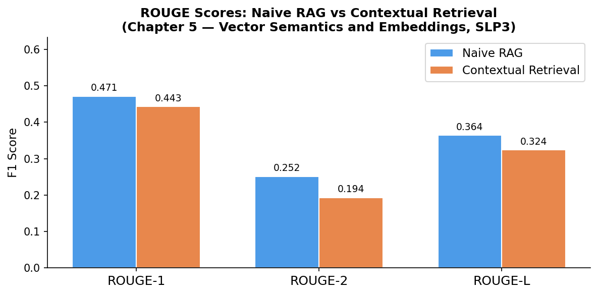

# A6: Naive RAG vs Contextual Retrieval

**NLU Assignment 6** — Naive RAG vs Contextual Retrieval on Chapter 5 (Vector Semantics and Embeddings)
**Student**: Dechathon Niamsa-ard [st126235]

---

## Overview

This project implements and compares two Retrieval-Augmented Generation (RAG) pipelines on **Chapter 5: Vector Semantics and Embeddings** from the Stanford *Speech and Language Processing* (SLP3) textbook. The **Naive RAG** pipeline embeds raw text chunks directly using `text-embedding-3-small`, while **Contextual Retrieval** — inspired by [Anthropic's engineering blog](https://www.anthropic.com/engineering/contextual-retrieval) — prepends an LLM-generated contextual description to each chunk before embedding, giving the retriever richer signal about each chunk's role in the document. Both pipelines are evaluated with ROUGE scores across 20 QA pairs derived from the chapter, and a Streamlit web application brings the Contextual Retrieval pipeline to life as an interactive chatbot.

---

## Project Structure

```text
├── app/
│   ├── app.py               # Streamlit chat interface
│   ├── rag.py               # Contextual Retrieval backend (FAISS + gpt-4o-mini)
│   └── Dockerfile           # Container image for the web app
├── assets/
│   ├── rouge_comparison.png # ROUGE score bar chart (generated by notebook)
│   └── app-demo.gif         # Streamlit app gif
├── answer/
│   ├── qa_pairs_raw.json                        # Cached curated QA pairs
│   └── response-st126235-chapter-5.json         # Submission JSON (20 QA pairs)
├── data/
│   └── 5.pdf                # Chapter 5: Vector Semantics and Embeddings (SLP3)
├── index/                   # Persisted FAISS indices (generated by notebook)
│   ├── naive_faiss/
│   ├── contextual_faiss/
│   ├── contextual_chunks.json
│   └── evaluation_results.json
├── lab_06/
│   └── 01-rag-langchain.ipynb   # Lab reference notebook
├── "st126235_assignment_6.ipynb"   # Main assignment notebook (Tasks 1–3)
├── docker-compose.yml       # Docker Compose for the web app
├── pyproject.toml           # Project config & dependencies (managed by uv)
└── README.md                # This file
```

---

## Quick Start

```bash
# 1. Clone the repo and set up the virtual environment
uv venv && uv sync

# 2. Add your OpenAI API key to a .env file
echo "OPENAI_API_KEY=sk-..." > .env

# 3. Run the assignment notebook (Tasks 1–3 + JSON generation)
jupyter notebook "st126235_assignment_6.ipynb"

# 4. Run the Streamlit web app locally (after running the notebook)
cd app && streamlit run app.py
# → Open http://localhost:8501

# 5. Or run via Docker Compose (from the repo root)
docker-compose up --build
# → Open http://localhost:8501
```

> **Note:** Run the notebook completely (all cells) before starting the web app or Docker container —
> the app requires the pre-built FAISS index at `index/contextual_faiss/`.

---

## Task 1: Data Preparation (2 pts)

**Chapter:** Chapter 5 — Vector Semantics and Embeddings (SLP3) — selected because my student ID ends in **5**.

### Dataset

| Item | Details |
| ---- | ------- |
| **Textbook** | Jurafsky, D. & Martin, J.H. (2024). *Speech and Language Processing*, 3rd ed. (draft) |
| **Chapter** | Chapter 5: Vector Semantics and Embeddings |
| **Source** | [web.stanford.edu/~jurafsky/slp3/5.pdf](https://web.stanford.edu/~jurafsky/slp3/5.pdf) |
| **File** | `data/5.pdf` |

### Document Loading & Cleaning

The chapter PDF (`data/5.pdf`) is loaded page-by-page using **PyMuPDF** (`fitz`). Each page undergoes three cleaning passes:

| Pass | Operation | Reason |
| ---- | --------- | ------ |
| 1 | Remove standalone digit-only lines (`^\s*\d+\s*$`) | Strips page numbers |
| 2 | Drop lines with ≤ 2 non-whitespace characters | Removes headers/footers/artefacts |
| 3 | Collapse `\n{3,}` → `\n\n`, collapse repeated spaces | Normalises paragraph structure |

**Extracted text:** 83,393 characters from Chapter 5.

### Chunking Strategy

| Parameter | Value | Rationale |
| --------- | ----- | --------- |
| `chunk_size` | 800 chars | ≈ 200 tokens — fits gpt-4o-mini context while preserving enough detail per chunk |
| `chunk_overlap` | 100 chars | Prevents context loss at boundaries between adjacent chunks |
| `separators` | `["\n\n", "\n", ". ", " "]` | Recursive split — prefers paragraph then sentence then word boundaries |

**Result:** 130 chunks, average 701 chars, min/max 177/799 chars.

### QA Pair Dataset

20 question–answer pairs were manually curated from the chapter, covering:

| Category | Example topics |
| -------- | -------------- |
| Definitions | Distributional hypothesis, vector semantics, lemma vs. wordform |
| Mathematical concepts | Cosine similarity, dot product, co-occurrence matrix |
| Algorithms | Skip-gram, negative sampling, fasttext subword models |
| Analysis | Sparse vs. dense vectors, first/second-order co-occurrence, analogy tasks |
| Applied | Allocational bias/harm, evaluation datasets (WordSim-353, SimLex-999) |

Pairs are hardcoded as `CURATED_QA_PAIRS` in the notebook and cached to `answer/qa_pairs_raw.json` on first run.

---

## Task 2: Naive RAG vs Contextual Retrieval (2.5 pts)

### Models Used

| Component | Model | Role |
| --------- | ----- | ---- |
| **Embedder** | `text-embedding-3-small` | Converts text chunks and queries to dense vectors |
| **Generator** | `gpt-4o-mini` | Generates natural-language answers from retrieved context |
| **Context Enrichment LLM** | `gpt-4o-mini` | Prepends a 1–2 sentence contextual prefix to each chunk |

### Pipeline Architecture

```text
                   ┌─────────────────────────────────────────────┐
                   │           DOCUMENT PROCESSING               │
                   │  PDF → clean text → RecursiveCharTextSplit  │
                   └──────────────┬──────────────────────────────┘
                                  │ raw chunks (130)
              ┌───────────────────┴──────────────────────┐
              │                                          │
       NAIVE RAG                           CONTEXTUAL RETRIEVAL
       ─────────                           ────────────────────
  raw chunks                          raw chunks
  → embed(text-embedding-3-small)     → gpt-4o-mini(context prefix)
  → FAISS index                       → enriched chunks
        │                             → embed(text-embedding-3-small)
        │                             → FAISS index
        └────────── query → retrieve k=4 chunks ────────┘
                            │
                    gpt-4o-mini(generator)
                            │
                         answer
```

### Contextual Enrichment — Before and After

```text
BEFORE:
"CHAPTER 5
 EMBEDDINGS
 5.1 Lexical Semantics
 Let's begin by introducing some basic principles of word meaning. How should
 we represent the meaning of a word? In the n-gram models of Chapter 3, and in
 classical NLP applications, our only representation of a word is as a string of
 letters, or an index..."

AFTER:
"This chunk from Chapter 5: Vector Semantics and Embeddings (Speech and Language
 Processing, 3rd ed.) discusses the fundamental principles of word meaning
 representation in natural language processing (NLP). It critiques traditional
 methods, such as representing words merely as strings of letters or capitalized
 forms, and sets the stage for introducing more sophisticated models, like
 embeddings, that capture the semantic relationships between words based on their
 usage in context.

 CHAPTER 5
 EMBEDDINGS
 5.1 Lexical Semantics..."
```

All 130 chunks are enriched concurrently (async, semaphore cap of 8) and cached to `index/contextual_chunks.json`.

### ROUGE Evaluation Results

Average ROUGE F1 scores across all 20 QA pairs:

| Method | ROUGE-1 | ROUGE-2 | ROUGE-L |
| :--- | :---: | :---: | :---: |
| Naive RAG | **0.4713** | **0.2515** | **0.3639** |
| Contextual Retrieval | 0.4428 | 0.1935 | 0.3239 |



### Discussion

**Interpreting the metrics:**

- **ROUGE-1** measures unigram (word-level) overlap between the generated answer and the ground truth.
- **ROUGE-2** measures bigram overlap, capturing short phrase-level fidelity.
- **ROUGE-L** is based on the Longest Common Subsequence (LCS), rewarding answers that preserve the relative word order of the reference.

**Observed results:**

Naive RAG scored higher than Contextual Retrieval on all three metrics (ROUGE-1: 0.4713 vs 0.4428 · ROUGE-2: 0.2515 vs 0.1935 · ROUGE-L: 0.3639 vs 0.3239). This counter-intuitive result can be explained by the interaction between the evaluation metric and the nature of our QA dataset:

1. **ROUGE rewards lexical overlap with the ground truth.** The curated QA pairs use concise answers that closely mirror the phrasing in the chapter text. When Naive RAG retrieves the raw, unmodified chunk, the generator's output tends to echo the exact vocabulary of the source — which also happens to match the reference. Contextual Retrieval wraps each chunk in a contextual prefix, so the generator blends that meta-description language into its response, producing more semantically rich but *lexically divergent* answers that ROUGE penalises.

2. **Contextual enrichment is most valuable for ambiguous or multi-concept queries**, where a raw chunk's meaning is unclear without surrounding document context. For the relatively direct definitional and factual questions in our set, the raw chunk already contains sufficient signal for accurate retrieval, so the prefix adds little retrieval advantage while diluting the token vocabulary seen by the generator.

**Limitations of ROUGE:** ROUGE is a surface-level lexical metric that does not evaluate semantic correctness, factual accuracy, or coherence. These results demonstrate that ROUGE can even *favour* the simpler pipeline when ground-truth answers are written to match source text closely. Complementary metrics such as BERTScore or human evaluation would provide a fuller picture.

**Cost trade-off:** Contextual Retrieval requires *N* additional LLM API calls during indexing (one per chunk), roughly doubling the one-time offline cost. Once the enriched index is built and cached, query-time latency is identical to Naive RAG. Given that ROUGE scores did not improve on this dataset, the cost–benefit ratio of contextual enrichment depends strongly on query complexity and the evaluation metric chosen.

---

## Task 3: Streamlit Chatbot (0.5 pts)

A lightweight Streamlit chat application backed by the Contextual Retrieval pipeline.


### Features

- **Chat interface** — multi-turn conversation with full session history
- **Source citation** — each response shows the retrieved chunks in a collapsible expander
- **Cached index** — FAISS index loaded once per session via `@st.cache_resource`
- **Docker Compose** — one-command containerised deployment

### System Architecture

```text
┌──────────────────┐    user question    ┌──────────────────────────┐
│                  │ ─────────────────>  │                          │
│  Streamlit UI    │                     │   app.py (Streamlit)     │
│  (Browser)       │ <─────────────────  │   rag.py (RAG backend)   │
│                  │   answer + sources  │                          │
└──────────────────┘                     └────────────┬─────────────┘
                                                      │
                                         ┌────────────▼─────────────┐
                                         │  FAISS (contextual_faiss)│
                                         │  text-embedding-3-small  │
                                         │  gpt-4o-mini             │
                                         └──────────────────────────┘
```

### Running the App

```bash
# Local
cd app && streamlit run app.py
# → http://localhost:8501

# Docker Compose
docker-compose up --build
# → http://localhost:8501
```

---

## Dataset Sources

| Item | Details | Source |
| ---- | ------- | ------ |
| **Chapter PDF** | Chapter 5: Vector Semantics and Embeddings | [web.stanford.edu/~jurafsky/slp3](https://web.stanford.edu/~jurafsky/slp3/) |

---

## Technical Notes

- **Caching strategy:** All expensive API operations (chunk enrichment, evaluation) are cached to JSON files on first run. Re-running the notebook skips API calls entirely.
- **Unicode safety:** All JSON file writes use `encoding="utf-8"` explicitly to handle non-ASCII characters (e.g., © in chapter header) on Windows systems with cp874 default locale.
- **Async enrichment:** `asyncio.gather` with `asyncio.Semaphore(8)` enriches all 130 chunks concurrently while respecting OpenAI rate limits. `nest_asyncio.apply()` allows `asyncio.run()` inside Jupyter's existing event loop.
- **FAISS serialization:** `allow_dangerous_deserialization=True` is required by LangChain v0.3+ for `FAISS.load_local()`.
- **Docker volume mount:** The pre-built FAISS index is mounted read-only at `/workspace/index/` — the container does not rebuild it at startup.
- **FAISS_INDEX_PATH env var:** Allows the same `rag.py` to work locally (`../index/contextual_faiss`) and inside Docker (`/workspace/index/contextual_faiss`).

---

## References

- Jurafsky, D. & Martin, J.H. (2024). *Speech and Language Processing (3rd ed. draft)*. Stanford University. — [Web](https://web.stanford.edu/~jurafsky/slp3/)
- Anthropic (2024). *Introducing Contextual Retrieval*. — [Engineering Blog](https://www.anthropic.com/engineering/contextual-retrieval)
- LangChain. *RecursiveCharacterTextSplitter & FAISS integration*. — [Docs](https://python.langchain.com/docs/)
- OpenAI. *text-embedding-3-small & gpt-4o-mini*. — [API Reference](https://platform.openai.com/docs/)
- Lin, C.-Y. (2004). *ROUGE: A Package for Automatic Evaluation of Summaries*. — [ACL Anthology](https://aclanthology.org/W04-1013/)

---

## Requirements

- Python 3.12+
- OpenAI API key (`OPENAI_API_KEY` in `.env`)
- [uv](https://github.com/astral-sh/uv) for virtual environment management
- Docker + Docker Compose (optional, for containerised deployment)

Key packages: `openai`, `langchain`, `langchain-openai`, `langchain-community`, `faiss-cpu`,
`rouge-score`, `streamlit`, `pymupdf`, `nest-asyncio`, `python-dotenv`

See `pyproject.toml` for the full dependency list.

---
